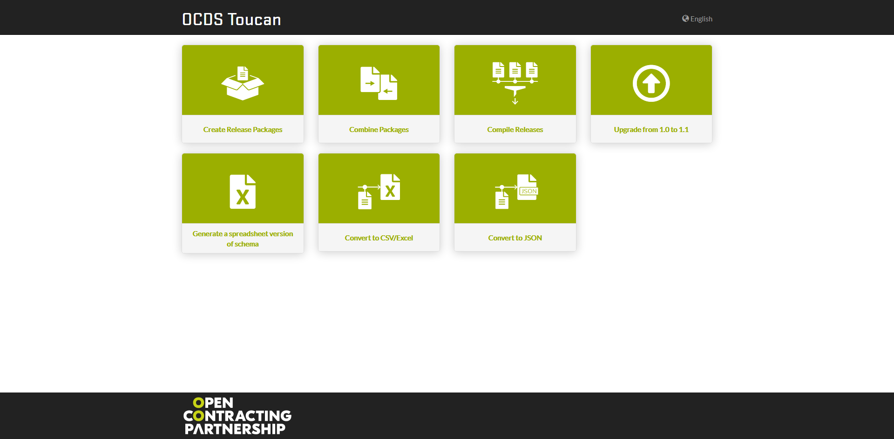
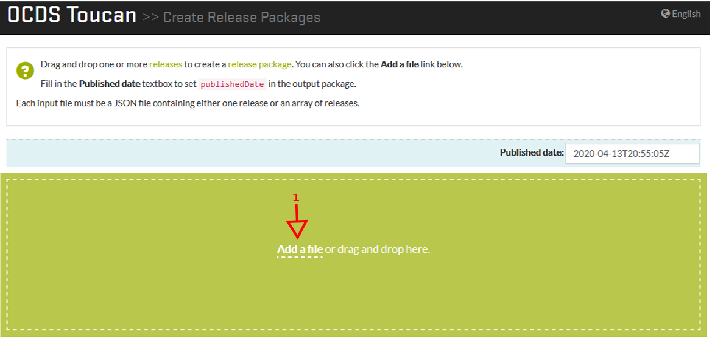
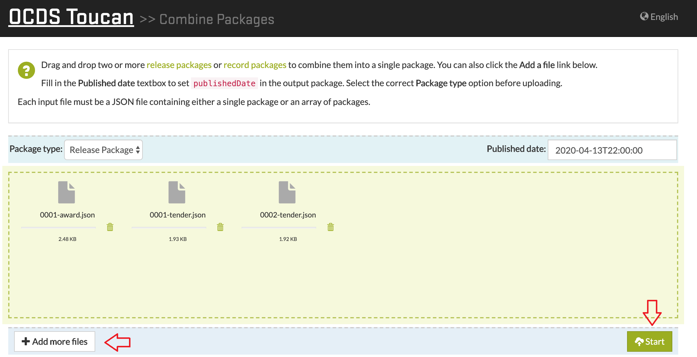
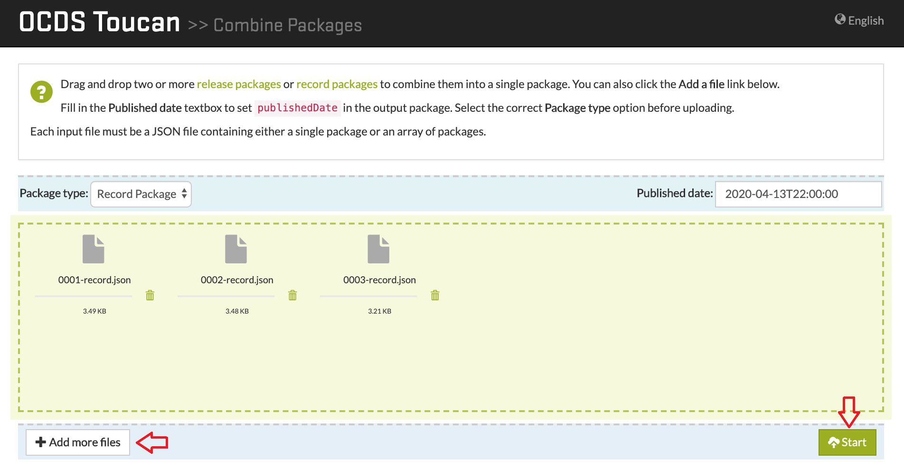
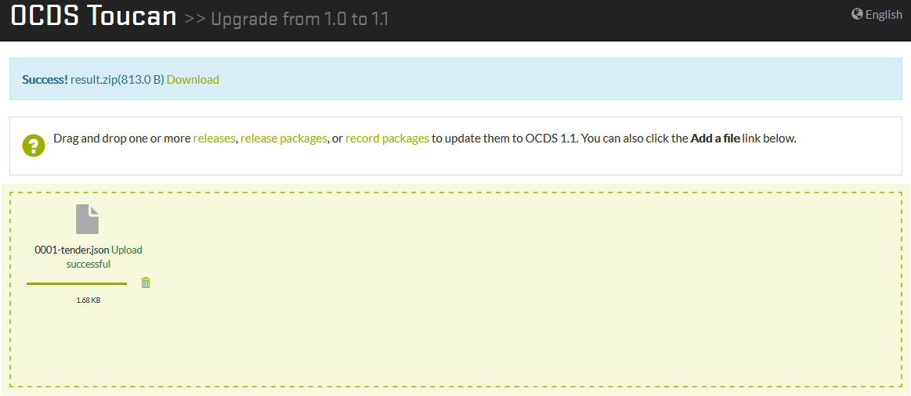
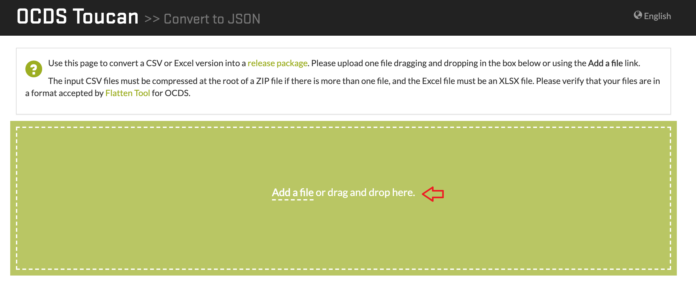

# OCDS Toucan

OCDS Toucan es una aplicación web para la manipulación de archivos OCDS basada en el proyecto [OCDS Kit](https://ocdskit.readthedocs.io/).
OCDS Toucan provee al usuario las mismas funcionalidades de OCDS Kit a través de una interfaz web intuitiva y fácil de utilizar.

## Inicio
### Prerequisitos
1. Instalar [Python 3.6+](https://www.python.org/downloads).
2. [Clonar](https://help.github.com/en/articles/cloning-a-repository) el proyecto de Github.
3. Instalar [virtualenv](https://docs.python-guide.org/dev/virtualenvs/#lower-level-virtualenv). **La instalación de esta herramienta es opcional, pero recomendada**.

### Instalación
1. Instalar las dependencias del proyecto:
```
pip install -r requirements.txt
```
2. Definir las siguientes variables de entorno:
* OCDS_TOUCAN_MEDIA_ROOT: ruta del directorio donde se guardan los archivos subidos. A libre elección.
* OCDS_TOUCAN_LOCALE_PATH: Debe apuntar al directorio locale/ dentro del proyecto.
* OCDS_TOUCAN_MAXNUMFILES: número máximo de archivos a subir por operación.
* OCDS_TOUCAN_MAXFILESIZE: tamaño máximo de archivos a subir en bytes.

### Configuracion 
El sistema se puede configurar asignando valores a las variables de entorno mencionadas arriba, se pueden ver los 
valores por defecto de algunas de estas variables en la siguiente tabla:

Restricción | Valor por defecto | Variable de entorno
--- | --- | ---
Tamaño máximo de archivos | 10MB | OCDS_TOUCAN_MAXFILESIZE
Cantidad máxima de archivos por operación | 20 | OCDS_TOUCAN_MAXNUMFILES:

### Levantar el proyecto
Levantar el servidor de desarrollo:
```
python manage.py runserver
```

## Funcionalidades
### Create Release Packages
Genera un [Release Package](http://standard.open-contracting.org/latest/en/getting_started/publication_patterns/#packaging-releases-and-records) a partir de varios archivos [Release](http://standard.open-contracting.org/latest/en/getting_started/releases_and_records/#releases).  
Utiliza el comando `package-releases`. [Más información](https://ocdskit.readthedocs.io/en/latest/cli/ocds.html#package-releases).
>Tipo de archivo válido: [Release](/tests/fixtures/1.1/releases).

### Combinar Paquetes
Combina paquetes de release o paquetes de record en un solo paquete.	
Utiliza el comando `combine-record-packages` para paquetes release. [Más información](https://ocdskit.readthedocs.io/en/latest/cli/ocds.html#combine-record-packages).		
Utiliza el comando `combine-release-packages` para paquetes record. [Más información](https://ocdskit.readthedocs.io/en/latest/cli/ocds.html#combine-release-packages).	
>Tipo de archivo válido: Release Package, Record Package.

### Compile Releases
Genera un [Record Package](http://standard.open-contracting.org/latest/en/getting_started/publication_patterns/#packaging-releases-and-records) a partir de archivos Release Package.  
Utiliza el comando `compile`. **Observación**: este comando utiliza como parámetros `--package` y `--versioned`, visite la [documentación](https://ocdskit.readthedocs.io/en/latest/cli/ocds.html#compile) del comando para más información.
>Tipo de archivo válido: [Release Packages](/tests/fixtures/1.1/release-packages).

### Upgrade from 1.0 to 1.1
Actualiza packages y releases de la versión 1.0 de OCDS a la 1.1.  
Utiliza el comando `upgrade`. [Más información](https://ocdskit.readthedocs.io/en/latest/cli/ocds.html#upgrade).
>Tipo de archivo válido: cualquier tipo.

### Generate a spreadsheet version of schema
Genera un spreadsheet de cualquier versión de un OCDS schema.  
Utiliza el comando `mapping-sheet`. [Más información](https://ocdskit.readthedocs.io/en/latest/cli/schema.html#mapping-sheet).
>Puede generar spreadsheets de [Release](/tests/fixtures/1.1/releases), [Release Packages](/tests/fixtures/1.1/release-packages) o [Record Packages](/tests/fixtures/1.1/record-packages).

### Convert to CSV/Excel
Convierte un archivo Release Package a una versión CSV/Excel.  
Utiliza la herramienta [flatten-tool](https://github.com/OpenDataServices/flatten-tool).
>Tipo de archivo válido: [Release Packages](/tests/fixtures/1.1/release-packages).

### Convertir a JSON
Convierte una versión de archivo con extensión CSV o Excel en un paquete de release.	
Utiliza la herramienta [flatten-tool](https://github.com/OpenDataServices/flatten-tool).
>Tipo de archivo válido: Release Package.

## Arquitectura
### Descripción  de la arquitectura
Se utiliza Django Framework para construir los módulos Fron-end y Back-end para la aplicación.
El módulo Front-end contiene los elementos de presentación para interactuar con el usuario.
En el módulo Back-end se encuentran implementados el OCDS Kit y el flatten-tool como librerias que implementan las funcionalidades.


### Diseño
Página principal de la aplicación:



### Restricciones
Las restricciones del sistema son las siguientes:

Restricción | Valor
--- | ---
Tamaño máximo de archivos | 10MB
Cantidad máxima de archivos por operación | 20
Timeout de sesión | 24 horas

## Ejemplos de uso

Las capturas de pantalla utilizadas en los diferentes ejemplos que siguen corresponden a como se ven las diferentes 
funcionalidades de la herramienta en abril de 2020 

### 1. Crear un Release Package
1. Elegir un archivo con "Add a file" o arrastrar al cuadro. Utilizaremos archivos [Release 1.1](/tests/fixtures/1.1/releases).

2. Añadir más archivos con el botón "Add more files" (2.1) o crear Release Package con "Start" (2.2).

3. Una vez terminado, aparecerá un cuadro para poder descargar el Release Package generado.


### 2. Combinar Paquetes

#### 2.1. Release Package
1. Para este ejemplo se utiliza la opción Release Package del cuadro Package type.
2. Elegir uno o más archivos Release Package con "Add a file" o arrastrar al cuadro. En este ejemplo se utilizan los archivos [Release Packages 1.1](/tests/fixtures/1.1/release-packages).

3. Podemos añadir más archivos con el botón "Add more files" o arrastrando al cuadro, como también se puede iniciar la operación con "Start".

4. Una vez terminado, aparecerá un cuadro para descargar el archivo generado.


#### 2.2. Record Package
1. Para este ejemplo se utiliza la opción Record Package del cuadro Package type.
2. Elegir uno o más archivos Record Package con "Add a file" o arrastrar al cuadro. En este ejemplo se utilizan los archivos [Record Packages 1.1](/tests/fixtures/1.1/record-packages).

3. Podemos añadir más archivos con el botón "Add more files" o arrastrando al cuadro, como también se puede iniciar la operación con "Start".

4. Una vez terminado, aparecerá un cuadro para descargar el archivo generado.


### 3. Compile Release Packages
1. Elegir un archivo con "Add a file" o arrastrar al cuadro, igual al primer ejemplo. Utilizaremos los [Release Packages 1.1](/tests/fixtures/1.1/release-packages) de ejemplo.
2. Igual que en el ejemplo anterior, podemos agregar más archivos o iniciar la operación. También tenemos la opción de incluir versionado de Releases en nuestro Record Package a generar.

3. Igual al anterior ejemplo, nos aparece un cuadro para descargar el Record Package generado.


### 4. Actualizar un archivo 1.0 a 1.1
1. Elegir uno o más archivos Release/Record Package que sean versión 1.0. Para este ejemplo utilizamos [este](/tests/fixtures/1.0/release-packages/0001-tender.json) archivo de prueba.
2. Podemos añadir más archivos 1.0 o iniciar la conversión.
3. Una vez terminado, aparecerá un cuadro para poder descargar los archivos actualizados.


### 5. Generar una versión spreadsheet de un OCDS schema
1. Elegir el tipo de schema y la versión a generar. En este ejemplo generaremos un Release Package Schema 1.1.

2. Se generará un archivo con extensión .csv y se descargará automáticamente.

### 6. Convertir un Release Package a .csv
1. Elegir el archivo Release Package a convertir. Sólo se puede subir uno. Utilizaremos [este](/tests/fixtures/1.1/release-packages/0002-tender.json) archivo de prueba.
2. Se generarán dos archivos, un archivo .xlsx y un comprimido con archivos .csv, que contienen los datos del Release Package..


### 7. Convertir a JSON
1. Elegir el archivo con extensión .csv o .xlsx a convertir. Para multiples archivos .csv, comprimir en formato .zip. Para este ejemplo se utiliza [este](/tests/fixtures/1.1/spreadsheets/flattened.csv) archivo.

2. Luego de elegir el archivo, presionar el botón "Start" para iniciar la operación.

3. Una vez terminado, aparecerá un cuadro para descargar el archivo generado.


## Herramientas utilizadas
* [Python 3.6+](https://www.python.org/) - Lenguaje de programación interpretado.
* [Django 2.2](https://www.djangoproject.com/) - Framework Web de Python.
* [JQuery 3.3](https://jquery.com/) - Biblioteca JavaScript.
* [Bootstrap 3+](https://getbootstrap.com/) - Biblioteca Multiplataforma.

## Versiones
Se utiliza Git para el control de versiones.

## Licencias
Copyright (c) Open Contracting Partnership
